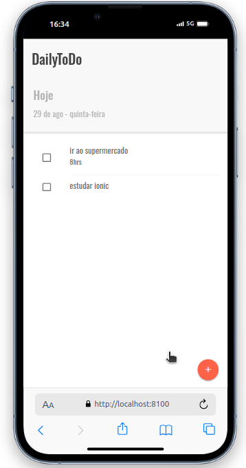
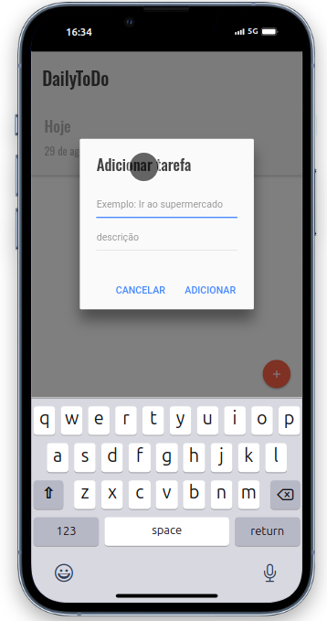

# 📋 TaskList - Aplicativo de Listagem de Tarefas

Bem-vindo ao **TaskList**, um aplicativo de listagem de tarefas desenvolvido com o [Ionic Framework](https://ionicframework.com/). Este aplicativo permite que você crie, edite e exclua tarefas de forma simples e intuitiva.

## 🛠️ Funcionalidades

- ✅ **Adicionar Tarefas:** Crie novas tarefas com facilidade.
- ✏️ **Editar Tarefas:** Atualize as informações das suas tarefas.
- ❌ **Excluir Tarefas:** Remova tarefas que já foram concluídas ou não são mais necessárias.
- 📅 **Organização Simples:** Mantenha suas tarefas organizadas em uma lista prática.

## 📱 Capturas de Tela

Aqui estão algumas capturas de tela do aplicativo em funcionamento:

## Tela de Listagem de Tarefas

### Tela de Adição de Tarefas

## 🎥 Demonstração em Vídeo

Assista a um vídeo demonstrativo do aplicativo em ação clicando [aqui](https://www.youtube.com/watch?v=seu-video).

## 🛠️ Tecnologias Utilizadas

- [Ionic Framework](https://ionicframework.com/)
- [Angular](https://angular.io/)
- [TypeScript](https://www.typescriptlang.org/)

## 📄 Licença

Este projeto está licenciado sob a licença MIT.

---

Feito com 💙 por [Kae](https://github.com/Kaesales)
